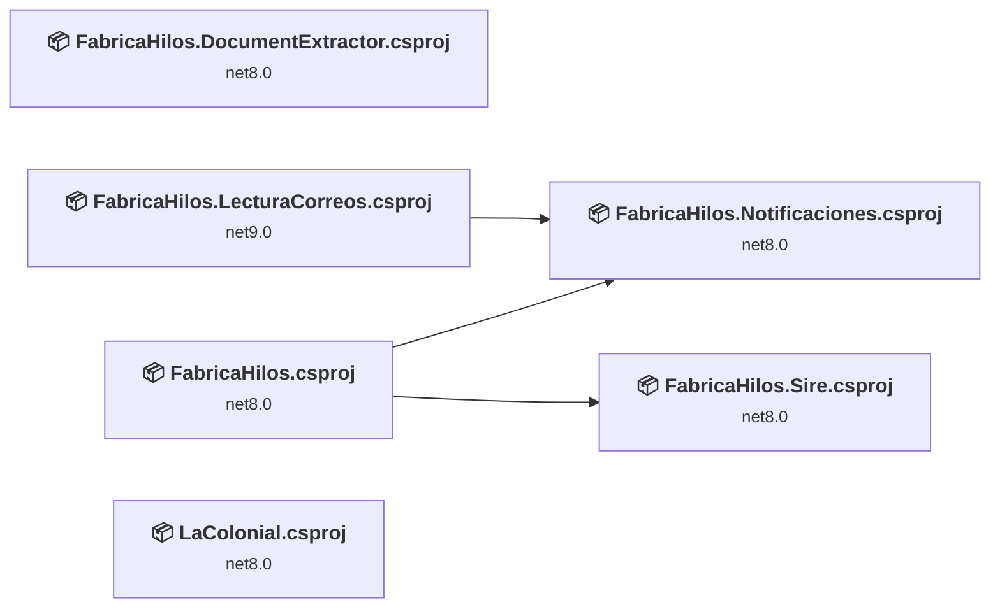
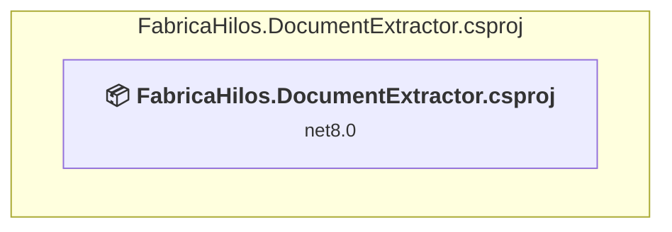
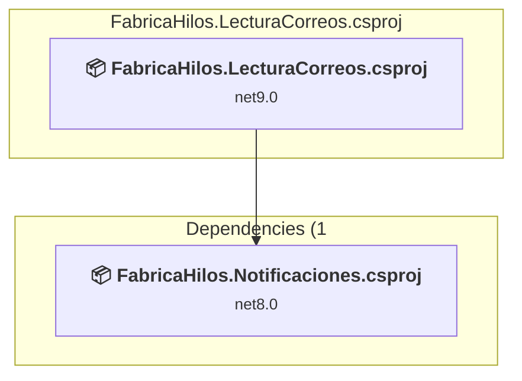
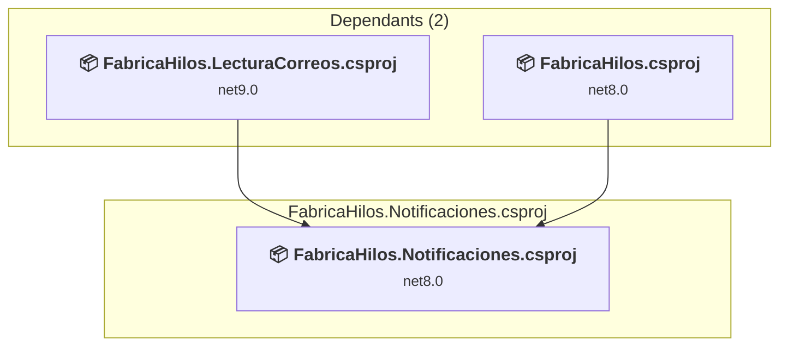
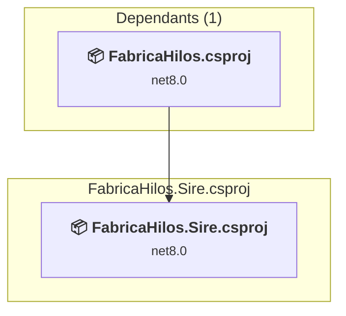
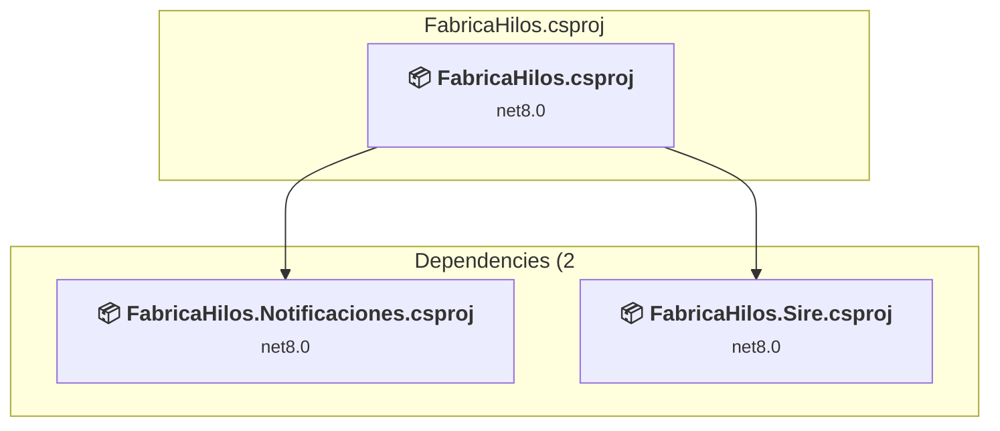
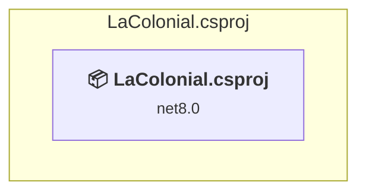

# Projects and dependencies analysis

This document provides a comprehensive overview of the projects and their dependencies in the context of upgrading to .NETCoreApp,Version=v10.0.

## Table of Contents

- [Executive Summary](#executive-Summary)
  - [Highlevel Metrics](#highlevel-metrics)
  - [Projects Compatibility](#projects-compatibility)
  - [Package Compatibility](#package-compatibility)
  - [API Compatibility](#api-compatibility)
  - [Binding Redirect Configuration](#binding-redirect-configuration)
- [Aggregate NuGet packages details](#aggregate-nuget-packages-details)
- [Top API Migration Challenges](#top-api-migration-challenges)
  - [Technologies and Features](#technologies-and-features)
  - [Most Frequent API Issues](#most-frequent-api-issues)
- [Projects Relationship Graph](#projects-relationship-graph)
- [Project Details](#project-details)

  - [FabricaHilos.DocumentExtractor\FabricaHilos.DocumentExtractor.csproj](#fabricahilosdocumentextractorfabricahilosdocumentextractorcsproj)
  - [FabricaHilos.LecturaCorreos\FabricaHilos.LecturaCorreos.csproj](#fabricahiloslecturacorreosfabricahiloslecturacorreoscsproj)
  - [FabricaHilos.Notificaciones\FabricaHilos.Notificaciones.csproj](#fabricahilosnotificacionesfabricahilosnotificacionescsproj)
  - [FabricaHilos.Sire\FabricaHilos.Sire.csproj](#fabricahilossirefabricahilossirecsproj)
  - [FabricaHilos\FabricaHilos.csproj](#fabricahilosfabricahiloscsproj)
  - [LaColonial\LaColonial.csproj](#lacoloniallacolonialcsproj)

## Executive Summary

### Highlevel Metrics

| Metric | Count | Status |
| :--- | :---: | :--- |
| Total Projects | 6 | All require upgrade |
| Total NuGet Packages | 33 | 14 need upgrade |
| Total Code Files | 589 |  |
| Total Code Files with Incidents | 42 |  |
| Total Lines of Code | 176251 |  |
| Total Number of Issues | 195 |  |
| Estimated LOC to modify | 174+ | at least 0.1% of codebase |

### Projects Compatibility

| Project | Target Framework | Difficulty | Package Issues | API Issues | Binding Issues | Est. LOC Impact | Description |
| :--- | :---: | :---: | :---: | :---: | :---: | :---: | :--- |
| [FabricaHilos.DocumentExtractor\FabricaHilos.DocumentExtractor.csproj](#fabricahilosdocumentextractorfabricahilosdocumentextractorcsproj) | net8.0 | 🟢 Low | 0 | 0 | 0 |  | AspNetCore, Sdk Style = True |
| [FabricaHilos.LecturaCorreos\FabricaHilos.LecturaCorreos.csproj](#fabricahiloslecturacorreosfabricahiloslecturacorreoscsproj) | net9.0 | 🟢 Low | 2 | 57 | 0 | 57+ | DotNetCoreApp, Sdk Style = True |
| [FabricaHilos.Notificaciones\FabricaHilos.Notificaciones.csproj](#fabricahilosnotificacionesfabricahilosnotificacionescsproj) | net8.0 | 🟢 Low | 3 | 1 | 0 | 1+ | ClassLibrary, Sdk Style = True |
| [FabricaHilos.Sire\FabricaHilos.Sire.csproj](#fabricahilossirefabricahilossirecsproj) | net8.0 | 🟢 Low | 3 | 26 | 0 | 26+ | ClassLibrary, Sdk Style = True |
| [FabricaHilos\FabricaHilos.csproj](#fabricahilosfabricahiloscsproj) | net8.0 | 🟢 Low | 7 | 88 | 0 | 88+ | AspNetCore, Sdk Style = True |
| [LaColonial\LaColonial.csproj](#lacoloniallacolonialcsproj) | net8.0 | 🟢 Low | 0 | 2 | 0 | 2+ | AspNetCore, Sdk Style = True |

### Package Compatibility

| Status | Count | Percentage |
| :--- | :---: | :---: |
| ✅ Compatible | 19 | 57.6% |
| ⚠️ Incompatible | 0 | 0.0% |
| 🔄 Upgrade Recommended | 14 | 42.4% |
| ***Total NuGet Packages*** | ***33*** | ***100%*** |

### API Compatibility

| Category | Count | Impact |
| :--- | :---: | :--- |
| 🔴 Binary Incompatible | 19 | High - Require code changes |
| 🟡 Source Incompatible | 51 | Medium - Needs re-compilation and potential conflicting API error fixing |
| 🔵 Behavioral change | 104 | Low - Behavioral changes that may require testing at runtime |
| ✅ Compatible | 328688 |  |
| ***Total APIs Analyzed*** | ***328862*** |  |

## Aggregate NuGet packages details

| Package | Current Version | Suggested Version | Projects | Description |
| :--- | :---: | :---: | :--- | :--- |
| AngleSharp | 1.2.0 |  | [FabricaHilos.LecturaCorreos.csproj](#fabricahiloslecturacorreosfabricahiloslecturacorreoscsproj) | ✅Compatible |
| ClosedXML | 0.102.3 |  | [FabricaHilos.csproj](#fabricahilosfabricahiloscsproj) | ✅Compatible |
| Dapper | 2.1.66 |  | [FabricaHilos.csproj](#fabricahilosfabricahiloscsproj) [FabricaHilos.LecturaCorreos.csproj](#fabricahiloslecturacorreosfabricahiloslecturacorreoscsproj) | ✅Compatible |
| MailKit | 4.16.0 |  | [FabricaHilos.LecturaCorreos.csproj](#fabricahiloslecturacorreosfabricahiloslecturacorreoscsproj) [FabricaHilos.Notificaciones.csproj](#fabricahilosnotificacionesfabricahilosnotificacionescsproj) | ✅Compatible |
| Microsoft.AspNetCore.Identity.EntityFrameworkCore | 8.0.0 | 10.0.10 | [FabricaHilos.csproj](#fabricahilosfabricahiloscsproj) | Se recomienda actualizar el paquete NuGet |
| Microsoft.AspNetCore.Mvc.Razor.RuntimeCompilation | 8.0.* | 10.0.10 | [FabricaHilos.csproj](#fabricahilosfabricahiloscsproj) | Se recomienda actualizar el paquete NuGet |
| Microsoft.EntityFrameworkCore.Design | 8.0.0 | 10.0.10 | [FabricaHilos.csproj](#fabricahilosfabricahiloscsproj) | Se recomienda actualizar el paquete NuGet |
| Microsoft.EntityFrameworkCore.Sqlite | 8.0.0 | 10.0.10 | [FabricaHilos.csproj](#fabricahilosfabricahiloscsproj) | Se recomienda actualizar el paquete NuGet |
| Microsoft.EntityFrameworkCore.Tools | 8.0.0 | 10.0.10 | [FabricaHilos.csproj](#fabricahilosfabricahiloscsproj) | Se recomienda actualizar el paquete NuGet |
| Microsoft.Extensions.Caching.Memory | 8.0.1 | 10.0.10 | [FabricaHilos.csproj](#fabricahilosfabricahiloscsproj) [FabricaHilos.Sire.csproj](#fabricahilossirefabricahilossirecsproj) | Se recomienda actualizar el paquete NuGet |
| Microsoft.Extensions.DependencyInjection.Abstractions | 8.0.0 | 10.0.10 | [FabricaHilos.Notificaciones.csproj](#fabricahilosnotificacionesfabricahilosnotificacionescsproj) | Se recomienda actualizar el paquete NuGet |
| Microsoft.Extensions.Hosting.WindowsServices | 9.0.0 | 10.0.10 | [FabricaHilos.LecturaCorreos.csproj](#fabricahiloslecturacorreosfabricahiloslecturacorreoscsproj) | Se recomienda actualizar el paquete NuGet |
| Microsoft.Extensions.Http | 9.0.0 | 10.0.10 | [FabricaHilos.LecturaCorreos.csproj](#fabricahiloslecturacorreosfabricahiloslecturacorreoscsproj) | Se recomienda actualizar el paquete NuGet |
| Microsoft.Extensions.Logging.Abstractions | 8.0.0 | 10.0.10 | [FabricaHilos.Notificaciones.csproj](#fabricahilosnotificacionesfabricahilosnotificacionescsproj) | Se recomienda actualizar el paquete NuGet |
| Microsoft.Extensions.Logging.Abstractions | 8.0.2 | 10.0.10 | [FabricaHilos.Sire.csproj](#fabricahilossirefabricahilossirecsproj) | Se recomienda actualizar el paquete NuGet |
| Microsoft.Extensions.Options | 8.0.2 | 10.0.10 | [FabricaHilos.Sire.csproj](#fabricahilossirefabricahilossirecsproj) | Se recomienda actualizar el paquete NuGet |
| Microsoft.Extensions.Options.ConfigurationExtensions | 8.0.0 | 10.0.10 | [FabricaHilos.Notificaciones.csproj](#fabricahilosnotificacionesfabricahilosnotificacionescsproj) | Se recomienda actualizar el paquete NuGet |
| MimeKit | 4.16.0 |  | [FabricaHilos.LecturaCorreos.csproj](#fabricahiloslecturacorreosfabricahiloslecturacorreoscsproj) [FabricaHilos.Notificaciones.csproj](#fabricahilosnotificacionesfabricahilosnotificacionescsproj) | ✅Compatible |
| Oracle.ManagedDataAccess.Core | 23.26.100 |  | [FabricaHilos.csproj](#fabricahilosfabricahiloscsproj) | ✅Compatible |
| Oracle.ManagedDataAccess.Core | 23.7.0 |  | [FabricaHilos.LecturaCorreos.csproj](#fabricahiloslecturacorreosfabricahiloslecturacorreoscsproj) | ✅Compatible |
| PdfPig | 0.1.14 |  | [FabricaHilos.DocumentExtractor.csproj](#fabricahilosdocumentextractorfabricahilosdocumentextractorcsproj) | ✅Compatible |
| PDFtoImage | 5.2.0 |  | [FabricaHilos.DocumentExtractor.csproj](#fabricahilosdocumentextractorfabricahilosdocumentextractorcsproj) | ✅Compatible |
| QuestPDF | 2024.12.0 |  | [FabricaHilos.csproj](#fabricahilosfabricahiloscsproj) | ✅Compatible |
| Serilog.AspNetCore | 10.0.0 |  | [FabricaHilos.csproj](#fabricahilosfabricahiloscsproj) | ✅Compatible |
| Serilog.Extensions.Hosting | 9.0.0 |  | [FabricaHilos.LecturaCorreos.csproj](#fabricahiloslecturacorreosfabricahiloslecturacorreoscsproj) | ✅Compatible |
| Serilog.Settings.Configuration | 9.0.0 |  | [FabricaHilos.LecturaCorreos.csproj](#fabricahiloslecturacorreosfabricahiloslecturacorreoscsproj) | ✅Compatible |
| Serilog.Sinks.Console | 6.0.0 |  | [FabricaHilos.LecturaCorreos.csproj](#fabricahiloslecturacorreosfabricahiloslecturacorreoscsproj) | ✅Compatible |
| Serilog.Sinks.Console | 6.1.1 |  | [FabricaHilos.csproj](#fabricahilosfabricahiloscsproj) | ✅Compatible |
| Serilog.Sinks.File | 6.0.0 |  | [FabricaHilos.LecturaCorreos.csproj](#fabricahiloslecturacorreosfabricahiloslecturacorreoscsproj) | ✅Compatible |
| SixLabors.ImageSharp | 3.1.12 |  | [FabricaHilos.csproj](#fabricahilosfabricahiloscsproj) | ✅Compatible |
| Swashbuckle.AspNetCore | 6.5.0 |  | [FabricaHilos.DocumentExtractor.csproj](#fabricahilosdocumentextractorfabricahilosdocumentextractorcsproj) | ✅Compatible |
| System.IO.Packaging | 6.0.1 | 10.0.10 | [FabricaHilos.csproj](#fabricahilosfabricahiloscsproj) | Se recomienda actualizar el paquete NuGet |
| Tesseract | 5.2.0 |  | [FabricaHilos.DocumentExtractor.csproj](#fabricahilosdocumentextractorfabricahilosdocumentextractorcsproj) | ✅Compatible |

## Top API Migration Challenges

### Technologies and Features

| Technology | Issues | Percentage | Migration Path |
| :--- | :---: | :---: | :--- |

### Most Frequent API Issues

| API | Count | Percentage | Category |
| :--- | :---: | :---: | :--- |
| T:System.Net.Http.HttpContent | 39 | 22.4% | Behavioral Change |
| T:System.Uri | 34 | 19.5% | Behavioral Change |
| M:System.TimeSpan.FromMinutes(System.Double) | 18 | 10.3% | Source Incompatible |
| T:System.Text.Json.JsonDocument | 10 | 5.7% | Behavioral Change |
| M:System.TimeSpan.FromSeconds(System.Double) | 9 | 5.2% | Source Incompatible |
| M:System.TimeSpan.FromMinutes(System.Int64) | 9 | 5.2% | Source Incompatible |
| M:Microsoft.Extensions.Configuration.ConfigurationBinder.Get''1(Microsoft.Extensions.Configuration.IConfiguration) | 8 | 4.6% | Binary Incompatible |
| M:System.TimeSpan.FromSeconds(System.Int64) | 8 | 4.6% | Source Incompatible |
| M:Microsoft.Extensions.DependencyInjection.OptionsConfigurationServiceCollectionExtensions.Configure''1(Microsoft.Extensions.DependencyInjection.IServiceCollection,Microsoft.Extensions.Configuration.IConfiguration) | 7 | 4.0% | Binary Incompatible |
| M:Microsoft.Extensions.Configuration.ConfigurationBinder.GetValue''1(Microsoft.Extensions.Configuration.IConfiguration,System.String) | 4 | 2.3% | Binary Incompatible |
| M:System.Uri.#ctor(System.String) | 4 | 2.3% | Behavioral Change |
| M:System.Uri.#ctor(System.Uri,System.String) | 4 | 2.3% | Behavioral Change |
| M:System.IO.Compression.ZipArchive.CreateEntry(System.String,System.IO.Compression.CompressionLevel) | 3 | 1.7% | Behavioral Change |
| P:System.Uri.AbsoluteUri | 3 | 1.7% | Behavioral Change |
| M:Microsoft.AspNetCore.Builder.ExceptionHandlerExtensions.UseExceptionHandler(Microsoft.AspNetCore.Builder.IApplicationBuilder,System.String) | 2 | 1.1% | Behavioral Change |
| M:Microsoft.Extensions.DependencyInjection.HttpClientFactoryServiceCollectionExtensions.AddHttpClient(Microsoft.Extensions.DependencyInjection.IServiceCollection,System.String) | 2 | 1.1% | Behavioral Change |
| M:System.TimeSpan.FromHours(System.Double) | 2 | 1.1% | Source Incompatible |
| M:System.Net.Http.HttpContent.ReadAsStreamAsync(System.Threading.CancellationToken) | 1 | 0.6% | Behavioral Change |
| M:Microsoft.Extensions.DependencyInjection.RazorRuntimeCompilationMvcBuilderExtensions.AddRazorRuntimeCompilation(Microsoft.Extensions.DependencyInjection.IMvcBuilder) | 1 | 0.6% | Source Incompatible |
| M:Microsoft.Extensions.DependencyInjection.HttpClientFactoryServiceCollectionExtensions.AddHttpClient(Microsoft.Extensions.DependencyInjection.IServiceCollection,System.String,System.Action{System.Net.Http.HttpClient}) | 1 | 0.6% | Behavioral Change |
| T:Microsoft.Extensions.DependencyInjection.IdentityEntityFrameworkBuilderExtensions | 1 | 0.6% | Source Incompatible |
| M:Microsoft.Extensions.DependencyInjection.IdentityEntityFrameworkBuilderExtensions.AddEntityFrameworkStores''1(Microsoft.AspNetCore.Identity.IdentityBuilder) | 1 | 0.6% | Source Incompatible |
| T:System.Net.ServicePointManager | 1 | 0.6% | Source Incompatible |
| M:System.IO.Path.Combine(System.ReadOnlySpan{System.String}) | 1 | 0.6% | Source Incompatible |
| P:System.Uri.PathAndQuery | 1 | 0.6% | Behavioral Change |

## Projects Relationship Graph

Legend:
📦 SDK-style project
⚙️ Classic project

## Project Details

### FabricaHilos.DocumentExtractor\FabricaHilos.DocumentExtractor.csproj

#### Project Info

- **Current Target Framework:** net8.0
- **Proposed Target Framework:** net10.0
- **SDK-style**: True
- **Project Kind:** AspNetCore
- **Dependencies**: 0
- **Dependants**: 0
- **Number of Files**: 5
- **Number of Files with Incidents**: 1
- **Lines of Code**: 953
- **Estimated LOC to modify**: 0+ (at least 0.0% of the project)

#### Dependency Graph

Legend:
📦 SDK-style project
⚙️ Classic project

### API Compatibility

| Category | Count | Impact |
| :--- | :---: | :--- |
| 🔴 Binary Incompatible | 0 | High - Require code changes |
| 🟡 Source Incompatible | 0 | Medium - Needs re-compilation and potential conflicting API error fixing |
| 🔵 Behavioral change | 0 | Low - Behavioral changes that may require testing at runtime |
| ✅ Compatible | 1660 |  |
| ***Total APIs Analyzed*** | ***1660*** |  |

### FabricaHilos.LecturaCorreos\FabricaHilos.LecturaCorreos.csproj

#### Project Info

- **Current Target Framework:** net9.0
- **Proposed Target Framework:** net10.0
- **SDK-style**: True
- **Project Kind:** DotNetCoreApp
- **Dependencies**: 1
- **Dependants**: 0
- **Number of Files**: 56
- **Number of Files with Incidents**: 11
- **Lines of Code**: 6660
- **Estimated LOC to modify**: 57+ (at least 0.9% of the project)

#### Dependency Graph

Legend:
📦 SDK-style project
⚙️ Classic project

### API Compatibility

| Category | Count | Impact |
| :--- | :---: | :--- |
| 🔴 Binary Incompatible | 1 | High - Require code changes |
| 🟡 Source Incompatible | 18 | Medium - Needs re-compilation and potential conflicting API error fixing |
| 🔵 Behavioral change | 38 | Low - Behavioral changes that may require testing at runtime |
| ✅ Compatible | 9530 |  |
| ***Total APIs Analyzed*** | ***9587*** |  |

### FabricaHilos.Notificaciones\FabricaHilos.Notificaciones.csproj

#### Project Info

- **Current Target Framework:** net8.0
- **Proposed Target Framework:** net10.0
- **SDK-style**: True
- **Project Kind:** ClassLibrary
- **Dependencies**: 0
- **Dependants**: 2
- **Number of Files**: 22
- **Number of Files with Incidents**: 2
- **Lines of Code**: 686
- **Estimated LOC to modify**: 1+ (at least 0.1% of the project)

#### Dependency Graph

Legend:
📦 SDK-style project
⚙️ Classic project

### API Compatibility

| Category | Count | Impact |
| :--- | :---: | :--- |
| 🔴 Binary Incompatible | 1 | High - Require code changes |
| 🟡 Source Incompatible | 0 | Medium - Needs re-compilation and potential conflicting API error fixing |
| 🔵 Behavioral change | 0 | Low - Behavioral changes that may require testing at runtime |
| ✅ Compatible | 855 |  |
| ***Total APIs Analyzed*** | ***856*** |  |

### FabricaHilos.Sire\FabricaHilos.Sire.csproj

#### Project Info

- **Current Target Framework:** net8.0
- **Proposed Target Framework:** net10.0
- **SDK-style**: True
- **Project Kind:** ClassLibrary
- **Dependencies**: 0
- **Dependants**: 1
- **Number of Files**: 34
- **Number of Files with Incidents**: 5
- **Lines of Code**: 2217
- **Estimated LOC to modify**: 26+ (at least 1.2% of the project)

#### Dependency Graph

Legend:
📦 SDK-style project
⚙️ Classic project

### API Compatibility

| Category | Count | Impact |
| :--- | :---: | :--- |
| 🔴 Binary Incompatible | 0 | High - Require code changes |
| 🟡 Source Incompatible | 0 | Medium - Needs re-compilation and potential conflicting API error fixing |
| 🔵 Behavioral change | 26 | Low - Behavioral changes that may require testing at runtime |
| ✅ Compatible | 3179 |  |
| ***Total APIs Analyzed*** | ***3205*** |  |

### FabricaHilos\FabricaHilos.csproj

#### Project Info

- **Current Target Framework:** net8.0
- **Proposed Target Framework:** net10.0
- **SDK-style**: True
- **Project Kind:** AspNetCore
- **Dependencies**: 2
- **Dependants**: 0
- **Number of Files**: 532
- **Number of Files with Incidents**: 20
- **Lines of Code**: 162533
- **Estimated LOC to modify**: 88+ (at least 0.1% of the project)

#### Dependency Graph

Legend:
📦 SDK-style project
⚙️ Classic project

### API Compatibility

| Category | Count | Impact |
| :--- | :---: | :--- |
| 🔴 Binary Incompatible | 17 | High - Require code changes |
| 🟡 Source Incompatible | 33 | Medium - Needs re-compilation and potential conflicting API error fixing |
| 🔵 Behavioral change | 38 | Low - Behavioral changes that may require testing at runtime |
| ✅ Compatible | 308212 |  |
| ***Total APIs Analyzed*** | ***308300*** |  |

### LaColonial\LaColonial.csproj

#### Project Info

- **Current Target Framework:** net8.0
- **Proposed Target Framework:** net10.0
- **SDK-style**: True
- **Project Kind:** AspNetCore
- **Dependencies**: 0
- **Dependants**: 0
- **Number of Files**: 113
- **Number of Files with Incidents**: 3
- **Lines of Code**: 3202
- **Estimated LOC to modify**: 2+ (at least 0.1% of the project)

#### Dependency Graph

Legend:
📦 SDK-style project
⚙️ Classic project

### API Compatibility

| Category | Count | Impact |
| :--- | :---: | :--- |
| 🔴 Binary Incompatible | 0 | High - Require code changes |
| 🟡 Source Incompatible | 0 | Medium - Needs re-compilation and potential conflicting API error fixing |
| 🔵 Behavioral change | 2 | Low - Behavioral changes that may require testing at runtime |
| ✅ Compatible | 5252 |  |
| ***Total APIs Analyzed*** | ***5254*** |  |

